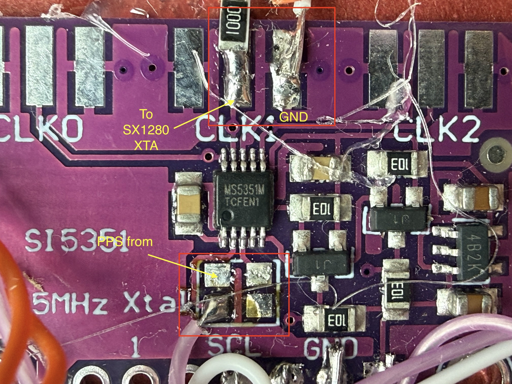
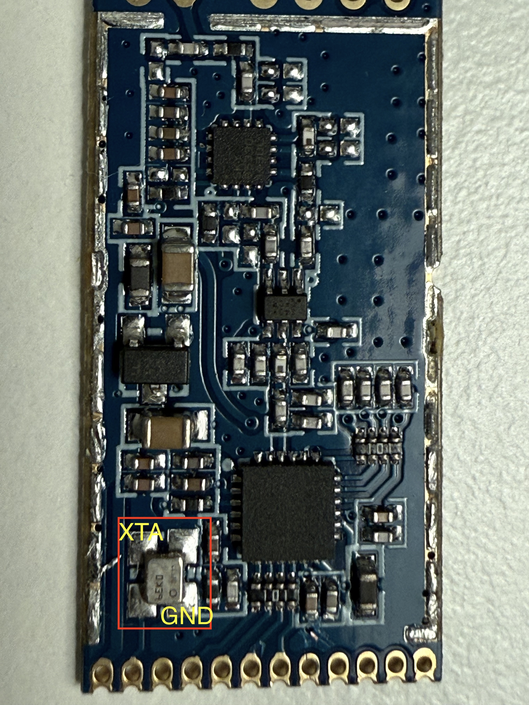

# SX1280 QO-100 SSB/CW Transmitter with GPS-Disciplined Oscillator

> **Work in progress.** It is not yet clear whether this project is useful to anyone
> beyond my own shack. The README is incomplete, photos will be added later, and some
> sections may still be inaccurate. If you find it useful or have questions, feel free
> to open an issue. This is my first attempt at working with Github, Claude and code. No guarantee for anything.

A 2.4 GHz uplink transmitter for the QO-100 geostationary amateur radio satellite,
built around the Semtech SX1280 LoRa chip and a Raspberry Pi Pico 2.

This is a fork of [SP8ESA's SX1280_QO100_SSB_TX](https://github.com/SP8ESA/SX1280_QO100_SSB_TX).

---

## What this project adds

- **GPS-disciplined oscillator (GPSDO)** integrated directly into the Pico firmware —
  no separate Arduino Nano required
- **Rock-stable frequency**: GPS-locked reference eliminates the thermal drift of the
  SX1280's internal TCXO, making SSB and narrow digital modes fully usable
- **Two-stage transmit lock**: the radio starts as soon as the 52 MHz reference is
  locked, but transmission stays blocked until GPS delivers UTC
- **CW keyer in the firmware** — iambic A/B and straight key, keyed from a paddle
  plugged straight into the Pico. No PC involved.
- **Sidetone on headphones**, generated on the Pico
- **Microphone input** for SSB without a computer
- **OLED display and rotary encoder** — frequency, mode, keyer and audio settings,
  GPS time and locator, all on the device
- **Settings survive a power cycle**, stored in flash
- **Runs without a computer** — or with the Python GUI, which adds a GPSDO tab,
  a CW keyer tab and a debugging console

---

## Background

The original SP8ESA project demonstrated that the SX1280 LoRa chip can be used as a
direct IQ-modulated 2.4 GHz SSB transmitter. The chip accepts raw IQ samples over SPI,
which the Pico writes at audio rate to produce SSB modulation.

The main problem encountered during testing was **frequency instability**: the SX1280F27
module (which includes an integrated 500 mW PA) runs its PA continuously, causing
significant thermal drift. SP8ESA has demonstrated that SSB is possible despite this,
and CW certainly works too — but in my tests the drift was severe enough to make
narrow digital modes (such as FT8) impossible to decode. The TCXO on the module cannot
compensate for it.

The solution is to replace the SX1280's internal reference entirely with a
GPS-disciplined SI5351 synthesizer — a technique originally described by
[CT2GQV](https://speakyssb.blogspot.com/2019/10/si5351-gps-disciplined-oscillator-with.html).

In this build the bare SX1280 module (~20 mW) is used instead of the SX1280F27.
The reason is simple: the external PA used here (SG Labs PA2400 V3) is fully driven
by 20 mW, so the integrated PA of the F27 is not needed. Whether the F27 produces
relevant spurious emissions compared to the bare module has not been systematically tested.
You can also use the SX1280f27, no problem.

---

## How the GPSDO works

```
NEO-7M TIMEPULSE pin: 24 MHz  →  SI5351 XA pin  →  CLK1: 52 MHz  →  100 Ω  →  SX1280 XTA
```

1. The NEO-7M is configured via UBX command `UBX-CFG-TP5` to output an exact **24 MHz
   timepulse** on its TIMEPULSE pin. 24 MHz = 48 MHz ÷ 2 — an exact integer divisor,
   no pulse-swallowing, no jitter.
2. The **quartz crystal on the SI5351 breakout board is desoldered**. The 24 MHz signal
   from the NEO-7M TIMEPULSE pin is fed directly into the XA pin of the SI5351,
   replacing the crystal.
3. The SI5351 synthesizes **52 MHz** from this GPS-locked reference via its PLL.
4. The 52 MHz signal is fed via a **100 Ω series resistor** into the **XTA pin of the
   SX1280**, replacing its internal TCXO (which must also be desoldered). No external
   coupling capacitor is needed — the SX1280 has one internally behind the XTA pin.

The GPSDO logic (UBX configuration, satellite count polling, timepulse validation) runs
directly on the Pico — the Arduino Nano from the original CT2GQV design is not needed.

### Two-stage startup

The SX1280 has **no clock of its own** in this build, so the firmware separates two
conditions that are easy to confuse:

| Stage | Condition | Effect |
|---|---|---|
| Clock present | SI5351 locked, 52 MHz running | SX1280 released from reset, device fully operable |
| GPS disciplined | GPS has delivered UTC | **Transmission released** |

This matters because the NEO-7M keeps emitting its 24 MHz timepulse even without a
satellite fix — from its own free-running oscillator, at ±2.5 ppm, which is roughly
**±6 kHz at 2.4 GHz**. On the QO-100 narrowband transponder that would land on someone
else, so transmission waits for real GPS time. The display shows `WAIT GPS` until then.

If the fix is acquired and later lost, the display blinks a warning and the GUI reports
it — the reference is then drifting again, even though the transmitter keeps working.

For bench testing into a dummy load, `gpsgate 0` overrides the transmit lock. It is
deliberately not saved and resets to enabled on every boot.


---

## CW

### Keyer in the firmware

A paddle or straight key plugs **directly into the Pico** (3.5 mm jack: tip = dit,
ring = dah, sleeve = ground). Element timing runs on the device, so CW works with no
computer attached.

- Modes: **Straight / Iambic A / Iambic B**
- Speed 5–60 WPM, adjustable dah ratio (2.0–5.0)
- Contact-bounce filtering and hold-to-repeat that behaves like a Curtis or K1EL keyer
- **Click-free keying**: the carrier ramps 1 dB per 160 µs rather than switching hard
- A **sidetone on the headphone output**, with adjustable pitch and volume
- The firmware also decodes what it keys and reports it to the GUI — useful for
  checking your own timing

Speed, mode and sidetone are reachable from the OLED menu or over the serial console
(`keyer wpm 22`, `keyer mode b`, `keyer tone 700`, `keyer vol 20`).

### Keyer on the PC

The original approach still works alongside: connect a key to a **TTL-to-USB serial
adapter** (CH340, CP2102), open the **CW Keyer tab** in the GUI, select the port,
mode and speed. Sidetone then comes from the PC audio output. Useful if you prefer to
operate from the computer, or want to send text from the GUI.


---

## Standalone operation

With display, encoder, paddle, microphone and headphones connected, the transmitter
needs no computer at all. It also boots without a USB host.

**Encoder:**
- **Turn** — frequency, 100 Hz per step
- **Short press** — browse the six tiles of the current page; press again to edit a
  value, turn to change it, press to leave
- **Long press (½ s)** — next page

**Pages:**

| Page | Contents |
|---|---|
| Operating | Mode (USB PC / USB MIC / CW), TUNE, WPM, TX state, sidetone volume, power |
| CW & audio | Keyer mode, dah ratio, WPM, sidetone pitch, microphone gain, noise gate |
| GPS & time | UTC, date, Maidenhead locator, satellites, fix state, altitude |

The frequency stays visible on all pages. Sidetone pitch and volume are audible while
being edited. Settings are written to flash a few seconds after the last change —
never while transmitting, since a flash write briefly stalls the core driving the SX1280.

`oled flip 1` rotates the display by 180° if it is mounted upside down.

---

## Hardware

### Bill of materials

| Part | Notes |
|---|---|
| Raspberry Pi Pico 2 (or Pico 2W) | Pico 2W recommended for future WiFi support |
| SX1280 module (no internal PA) | ~20 mW output; or SX1280f27 with ~500 mW integrated PA |
| u-blox NEO-7M GPS module | Must support UBX protocol — see note below |
| SI5351 breakout board | Crystal will be removed |
| Helix antenna (3D printed) | See below; or use a dish or Yagi |
| External PA (optional) | Needed without a large dish for CW and SSB |

### Optional, for standalone operation

| Part | Notes |
|---|---|
| SSD1306 OLED 128×64 | **0.96"** — the common 1.3" panels usually carry an SH1106 controller and will not work with this driver |
| Rotary encoder | KY-040 or similar, with push button. Supply from 3V3, never 5 V |
| CW paddle or straight key | 3.5 mm stereo jack |
| MAX4466 microphone module | Electret mic with amplifier, for SSB without a PC |
| Headphones | 3.5 mm jack plus three passive parts — no amplifier needed |

**Why the NEO-7M specifically?** Cheap GPS modules output only NMEA sentences and do
not support the UBX binary protocol. The NEO-7M supports `UBX-CFG-TP5`, which allows
configuring the timepulse output to exactly 24 MHz. This is essential for the GPSDO —
no other commonly available module supports this out of the box.

---

## Wiring diagram

```
Raspberry Pi Pico 2          SX1280 Module
===================          =============
GP16 (SPI0 MISO)   ───────── MISO
GP17 (SPI0 CS)     ───────── NSS / CS
GP18 (SPI0 SCK)    ───────── SCK
GP19 (SPI0 MOSI)   ───────── MOSI
GP20               ───────── NRESET
GP21               ───────── BUSY
GP22               ───────── TCXO_EN  (see note)
GP14               ───────── RX_EN
GP15               ───────── TX_EN
3V3                ───────── VCC
GND                ───────── GND

SI5351 (I2C0)                u-blox NEO-7M (UART1)
=============                =====================
GP0  (I2C0 SDA)    ── SDA   GP4  (UART1 TX)   ── RX
GP1  (I2C0 SCL)    ── SCL   GP5  (UART1 RX)   ── TX
CLK1  ── 100 Ω ── SX1280 XTA (keep wire short!)
3V3                ── VCC
GND                ── GND
Crystal: DESOLDER

NEO-7M TIMEPULSE pin  ──────── SI5351 XA pin
(24 MHz GPS reference; replaces SI5351 crystal)

OLED SSD1306 (I2C1)          Rotary encoder (KY-040)
===================          =======================
GP6  (I2C1 SDA)    ── SDA   GP2   ── CLK
GP7  (I2C1 SCL)    ── SCL   GP3   ── DT
3V3                ── VCC   GP10  ── SW
GND                ── GND   3V3   ── +     (NOT 5 V)
                            GND   ── GND

CW key jack (3.5 mm)         Microphone (MAX4466)
====================         ====================
GP9   ── Tip   (dit)         GP26 (ADC0) ── OUT
GP11  ── Ring  (dah)         3V3         ── VCC
GND   ── Sleeve              GND         ── GND

Headphone output (3.5 mm)
=========================
GP12 ──[ 100 Ω ]──┬──[ 10 µF ]──[ 220 Ω ]──► Tip + Ring
                  │   + towards GP12
               [ 100 nF ]
                  │
                 GND ──────────────────────► Sleeve

Optional: Decoupling
====================
SI5351  VCC:   100 nF ceramic directly at VCC pin
NEO-7M  VCC:   220 µF electrolytic + 100 nF ceramic close to module
SPI lines:     33 Ω series resistors on SCK/MOSI (reduce ringing)
I2C lines:     4.7 kΩ pull-up resistors on SDA/SCL (if not on breakout)
CLK1 → XTA:   100 Ω series resistor; shield wire or short coax run recommended
```

> **Do not connect DIO1.** The upstream project wires it to GP5; here GP5 is the GPS
> UART receive line. The firmware never uses DIO1 — the SX1280 is polled via BUSY.

> **About GP22 / TCXO_EN.** The firmware is built with `USE_TCXO_MODULE 0`, because the
> reference comes from the SI5351 rather than the module TCXO. In that configuration the
> firmware does not drive GP22 at all. If your board still needs TCXO_EN high, tie it
> high in hardware.

> **Headphone levels.** 0.7 mW into 32 Ω is already around 98 dB — start at
> `keyer vol 15`. The 10 µF capacitor is an electrolytic: plus towards the Pico, where
> the output idles at 1.65 V.

---

### Antenna

A 3D-printed helix antenna is a practical option if you do not have a dish.
The design used here is based on
[this Thingiverse model](https://www.thingiverse.com/thing:4980180), modified as follows:

- 8 turns
- Narrower wire feed holes (2 mm) for the antenna element
- M8 mounting holes
- Guide rail on the side — allows printing in two halves and gluing back together accurately

---

### Critical assembly notes

- **Desolder the crystal from the SI5351 board.** Without this, the XA input will not
  accept the external GPS signal. Connect the NEO-7M TIMEPULSE pin directly to the
  SI5351 XA pin.



- **Desolder the TCXO from the SX1280 module.**



- **100 Ω series resistor between SI5351 CLK1 and SX1280 XTA.** Damps ringing on the
  line. No external coupling capacitor is needed — the SX1280 has one internally behind
  the XTA pin.
- **Decoupling on NEO-7M VCC:** 220 µF electrolytic + 100 nF ceramic, placed close
  to the module might be good practice.
- **Decoupling on SI5351 VCC:** 100 nF ceramic directly at the VCC pin. A missing cap
  here could produce spurs.
- Build the GPSDO section (or the entire transmitter) in a metal enclosure if possible
  to reduce interference.

---

## Software

### Requirements

- Python 3.10+
- Git

### Installation

```bash
git clone https://github.com/SimonRZz/SX1280_QO100_SSB_TX
cd SX1280_QO100_SSB_TX
pip install -r requirements.txt
```

### Build the Pico firmware

```bash
mkdir build && cd build
cmake ..
make -j4
```

This produces a `.uf2` file in the `build/` directory.

### Flash the Pico firmware

1. Hold the **BOOTSEL** button on the Pico and connect it via USB — it appears as a
   mass storage device.
2. Copy the `.uf2` file from the `/build/` directory onto it.
3. The Pico reboots and starts running immediately.

The running build identifies itself on the OLED boot screen, in the serial greeting and
via the `version` command — handy when several builds are in circulation.

### Start the GUI

```bash
python gui.py
```
or
```bash
python3 gui.py
```

The GUI provides:

- **Frequency tuning** — uplink and downlink sliders, linked through the transponder LO
- **SSB transmit** via PC audio, with the full DSP chain (bandpass, equalizer, compressor)
- **GPSDO tab**: live satellite count, lock status, UTC, locator. Transmit is blocked
  until a valid GPS fix is confirmed, and a lost fix is reported.
- **CW keyer tab**: PC-side keyer via TTL-to-USB adapter, plus settings and a live view
  of the on-device keyer — paddle contacts, key state and decoded text
- **Console**: timestamped send/receive log with colour coding, filters, command history
  and log export — the first place to look when something misbehaves

---

## Serial commands

Everything the GUI does is also available over the USB serial port. `help` lists all
commands; the most useful ones:

| Command | Description |
|---|---|
| `get` / `version` / `diag` | Configuration, firmware build, full diagnostics |
| `gpsdo` | GPS status line |
| `gpsgate 0/1` | Transmit lock override for bench tests (not saved) |
| `freq <Hz>` / `ppm <v>` / `txpwr <dBm>` | Frequency, correction, power |
| `mode usb/cw` / `tx 0/1` / `tune 0/1` | Mode and transmit control |
| `keyer mode/wpm/ratio/tone/vol/test` | On-device keyer and sidetone |
| `src pc/mic` / `mic gain/gate` | Audio source and microphone |
| `oled flip 0/1` | Rotate the display |
| `save` / `defaults` | Write settings now / restore factory defaults |

---

## Transponder frequency calibration

The QO-100 narrowband transponder LO is not exactly at its nominal value.
Measure your signal on the [WebSDR](https://eshail.batc.org.uk/nb/) and adjust
the LO calibration value in the GUI. The value used in this build:
**8089.5001 MHz** (nominal is 8089.5 MHz).

---

## Known issues

- Above about 32 WPM the CW element timing becomes uneven — the keyer runs from the
  main polling loop rather than a hardware timer.
- A carrier at 2400.4 MHz sits at the lower edge of WLAN channel 1 and will disrupt
  2.4 GHz WiFi and Bluetooth nearby. Use a dummy load for bench testing.

---

## Planned / maybe someday

- **Headphone mixer**: sidetone, local microphone monitoring for SSB, and received audio
- **Receive path**: feed QO-100 audio (LNB → downconverter → handheld) into ADC1.
  Needs a level-shifting network — a handheld's audio output swings negative and would
  destroy the ADC input.
- **WiFi remote operation** using the Pico 2W's CYW43439 radio:
  cwdaemon-compatible UDP server on port 6789, web interface for frequency/speed/power,
  WiFi client or AP mode with onboarding page.
  Reference implementation for the concept: [ok1cdj/SX1281_QO100_TX](https://github.com/ok1cdj/SX1281_QO100_TX)

---

## Credits

- [SP8ESA](https://github.com/SP8ESA/SX1280_QO100_SSB_TX) — original SX1280 QO-100 SSB TX project
- [CT2GQV](https://speakyssb.blogspot.com/2019/10/si5351-gps-disciplined-oscillator-with.html) — SI5351 GPSDO concept
- [Thingiverse / original helix design](https://www.thingiverse.com/thing:4980180)

---

## License

GPL-3.0 — see [LICENSE](LICENSE)
